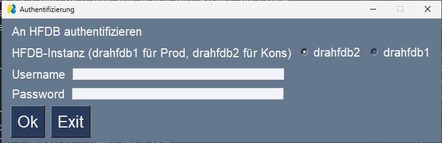
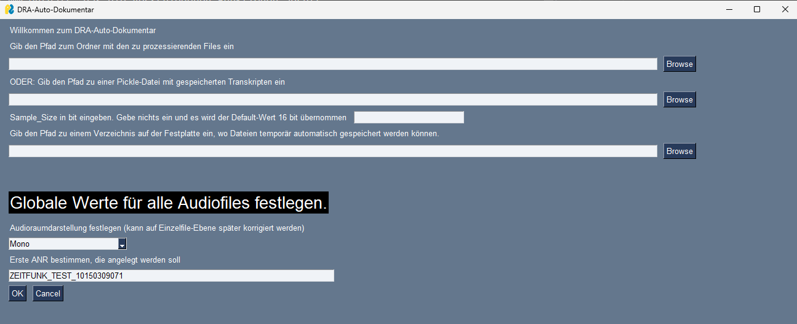
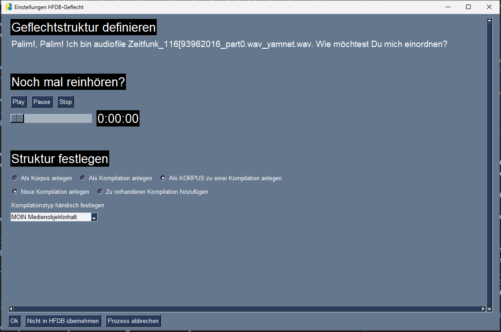
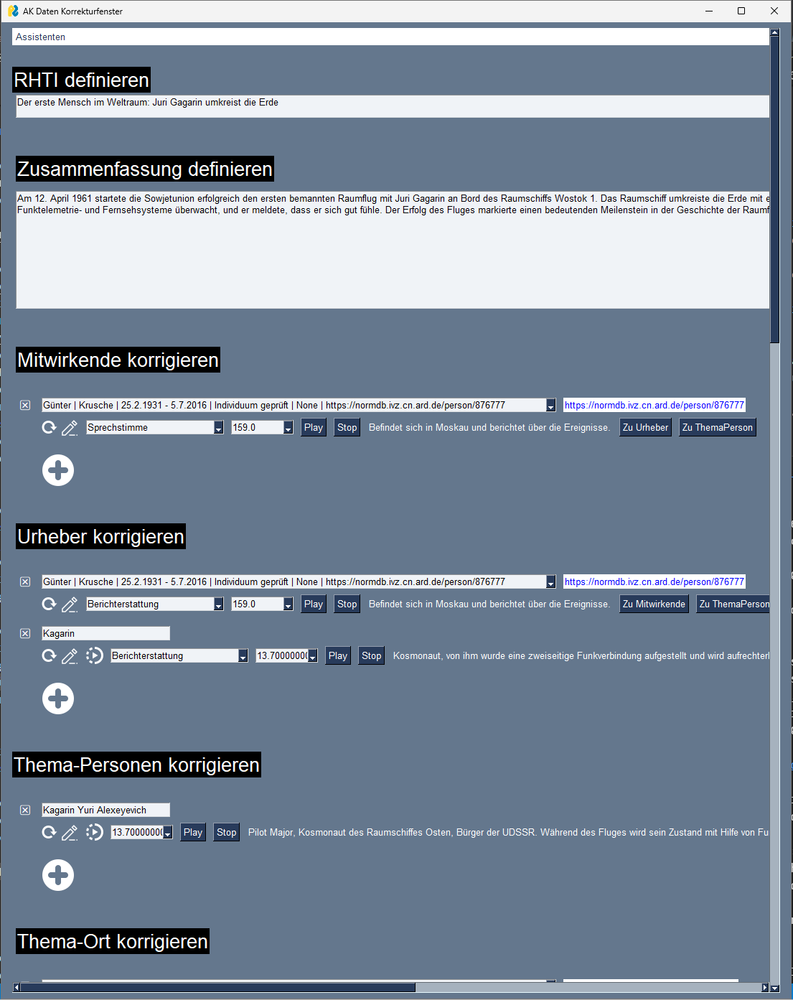

# DRA-Auto-Dok

## Beschreibung
Der DRA-Auto-Dok ist dazu gedacht die Dokumentation bislang nicht dokumentierter Audios zu unterstützen. Dafür wird das Audio zunächst analysiert und ein Transkript wird mittels Whisper erstellt. Anschließend werden die zu erstellenden Metadaten mittels einzelner Abfragen an einem LLM generiert und in einem Frontend angezeigt. Der User kann die erstellten Metadaten editieren, löschen und neue hinzufügen. Aus den erzeugten Daten werden dann Datensätze in der ARD Hörfunkdatenbank (HFDB) erzeugt.

## Voraussetzungen
Das DRA-Auto-Dok-Tool baut auf verschiedenen Technologien auf, die vorinstalliert bzw. zu denen Zugänge bereit stehen müssen. Die Wichtigsten seien hier genannt.
- HFDB-SOAP-Schnittstelle:
    Die HFDB wird über die Fremdsystemschnittstelle ("FSS-Schnittstelle") angesprochen. Dazu wird der SOAP-Client "zeep" genutzt. Die Ansprache der HFDB und die Authentifizierung an selbiger ist Grundlage für das Tool. Dafür sind die Einstellungen in der Datei "utils.py" auf die jeweilige HFDB-Instanz anzupassen und die Pfade zu den WSDL-Dateien in der Datei config.py einzutragen.
- Google Cloud Client:
    Um die Schnittstelle zur Google Cloud und den dort verfügbaren Gemini-LLM-Modellen nutzen zu können, muss natürlich ein Zugang zur Google Cloud bereitstehen. Dafür muss auf dem Rechner der Google Cloud CLI installiert sein und dort müssen die Zugangsdaten zur eigenen Google Cloud Instanz hinterlegt sein. Mehr dazu: https://cloud.google.com/sdk/docs/install?hl=de
    Auf der Google-Cloud muss ein Projekt und dort ein Bucket zum Zwischenspeichern von Audiodateien hinterlegt sein. Die Namen dieser Instanzen sind in der config-Datei einzutragen.
Für Whisper-Transkriptionen, die die Basis der Datenextraktion bilden und lokal ausgeführt werden, wird ein ausreichend leistungsstarker Rechner, idealerweise (aber nicht zwingend) mit einer leistungsstarken Grafikkarte und ausreichend Arbeitsspeicher empfohlen. Aktuell basiert das Tool auf Python-Version 3.12.4.

## Es gilt zu beachten, dass das Tool auf Basis der ARD-Hörfunkdatenbank entwickelt wurde und auf diese und speziell auf die Bedürfnisse des DRA als historischem Medienarchiv ausgerichtet ist! Ohne Zugang zur ARD-Hörfunkdatenbank-API ist es nicht per se  lauffähig.

## Installation
Zur Installation einfach die Library runterladen und lokal entpacken. Die Config-Datei mit den eigenen spezifischen Daten ausfüllen. Die utils.py Datei muss eventuell für das eigene Haus etwas angepasst werden. Die verschiedenen Module des Auto-Dok bauen auf verschiedenen Python-Libraries auf, die hier nicht im Einzelnen aufgeführt werden. Hier einfach auf die Imports der einzelnen Module schauen. Die Module sind alle recht einfach im Python Package Index (PyPi) zu finden und von dort einfach per pip zu installieren. Das Tool kann über die in der Library enthaltene DRA-Auto_Dok.bat-Datei ausgeführt werden, die nichts anderes macht als die __main__.py aufzurufen, die das Hauptprogramm enthält, das die verschiedenen Funktionen abruft. Im Ordner Excel-Lists-Entities sind bestimmte Excel-Listen mit Norm-DB Standard-Daten zu Rollen etc. hinterlegt. Diese wurden aus Datenschutzgründen für diese Veröffentlichung geleert und können aber problemlos bei uns angefordert werden oder selbst erstellt werden. AUch ist ein kompletter Datendump mit einem etwas älteren Stand für Personen normalerweise dort hinterlegt, der ebenfalls geleert wurde und für die Korrekturschleife des Transkripts mit SpaCy benötigt wird. Es sind aber FUnktionen zur Erstellung eines solchen Dumps im Auto-Dok integriert.

## Input
Als Input dient ein lokaler Ordner mit einem oder mehreren Audiofiles, für die Datensätze in der HFDB abgelegt werden sollen. Alternativ können pickle-Files als Input dienen, die Checkpoints des Gesamtprozesses abbilden und von denen aus wieder an einem bestimmten Punkt in den Prozess eingestiegen werden kann, so dass man nicht wieder ganz von vorne mit der Analyse anfangen muss.

## Output
Als Output werden Datensätze zu den Input-Audiofiles in der HFDB erzeugt.
Zusätzliche Outputs sind:
- pickle-Files:
    Es werden an verschiedenen Punkten pickle-Files geschrieben, die den Analyse-Zwischenstand abbilden und von denen aus der Zwischenstand geladen und die Analyse fortgeführt werden kann. Dies passiert einmal nach dem Transkriptionsprozess und einmal nach dem Anlegen jedes einzelnen Datensatzes in der HFDB.
- Excel-Übersichten:
    Nach jedem angelegten Datensatzgeflecht wird eine Übersichts-Excel erstellt, die alle angelegten Datensatz-IDs (für AKs, ABOs, AMOs, Konfektionierungen) enthält. Eine solche Excel wird auch als Gesamtübersicht am Ende des Prozesses nach Prozessierung aller Audiofiles erstellt.

## Programmablauf Frontend
1. Das Programm hat einen festen Anfang und ein festes Ende. Nach Aufruf der Main erscheint zunächst ein Login-Fenster, das es ermöglicht und es erfordert sich in der HFDB mit seinen normalen HFDB-Login-Daten zu authentifizieren. Es kann hier ausgewählt werden, ob man in der HFDB Prod oder in der HFDB Kons arbeiten möchte.

2. Es erscheint eine Art "Hauptmenü", in dem man verschiedene Pfade gehen kann.

Die ersten beiden Eingabefelder entscheiden darüber, ob ein komplett neuer Prozess angestoßen wird oder ein vorhandener Prozess aus einer pickle-Datei fortgeführt wird. Soll eine neue Analyse begonnen werden, so gibt man im ersten Eingabefeld den Pfad zu einem Ordner ein, der zu analysierende Audiodateien als Quelle für zu erstellende Metadaten enthält. Wurde ein solcher Prozess bereits begonnen und an einer geeigneten Stelle abgebrochen oder unterbrochen, so kann über das zweite Eingabefeld eine pickle-Datei mit einem gespeicherten Stand aufgerufen werden. Für beide Felder lässt sich über den "Browse" Button nach geeignetem Input auf der Festplatte suchen.
Das dritte Eingabefeld ist für einen Pfad zu einem beliebigen Ordner für die Ablage temporärer Dateien durch das Tool bestimmt. Dieser Pfad kann über die config.py fest vorgegeben werden.

In den unteren beiden Eingabefeldern lassen sich einmal, für den Fall eines neu angefangenen Prozesses, der Wert für die "Audioraumdarstellung" festlegen (gibt man eine pickle-File an, so wird dieser Wert aus der pickle-File mit geladen) und es kann die erste ANR angegeben werden unter der ein potentiell neues Datengeflecht angelegt wird. Endet diese mit einer Zahl, so wird von dieser Zahl automatisch bei jedem neuen Datengeflecht hoch gezählt.

Handelt es sich um eine neue Charge Audiofiles, die prozessiert werden soll, so wird nun der Pre-Processing Prozess angestoßen. Dabei wird u.a. Musik aus dem Audio entfernt und die Sprachpassagen werden mittels Whisper transkribiert.
Nun beginnt der Menü-Loop der für alle zu prozessierenden Audiofiles ausgeführt wird. Dieser enthält die nächsten beiden Fenster (3. und 4.).
3. Geflechtstruktur festlegen Menü

In diesem Fenster wird oben der Name der in diesem Schritt zu bearbeitenden Audiodatei angezeigt. Diese lässt sich über den Player auch noch mal anhören. Darunter kann gewählt werden, wie das Audio in den HFDB-Geflechtstrukturen anzulegen ist. Es kann z.B. als einzelne neue AudioKreation autark in der HFDB angelegt werden oder auch als Teil einer neuen oder vorhandenen Kompilation. Das Menü ist dynamisch und zeigt die verschiedenen Möglichkeiten je nach Vorauswahl an.

4. Datenerfassungs-Menü
Im Fenster  für die Datenerfassung können die durch die verschiedenen Datenextraktionsprozesse, insbesondere mittels Large Language Modell Gemini von Google, extrahierten Daten geprüft und korrigiert werden. Dafür stehen verschiedene Tools bereit.  Auch die Verlinkung in die ARD-Normdatenbank lässt sich hier steuern.

5. Abschlussfenster
Ist der Prozess für alle Files gelaufen, wird ein Info-Fenster angezeigt, das eine Liste der neu angelegten AKs enthält. Diese wird auch automatisch als Excel-Liste im Audio-Quell-Ordner abgelegt. Wird das Fenster bestätigt,  wird das Programm automatisch beendet. Für die nächste Charge an Audio-Dateien kann es nun neu gestartet werden und der Prozess beginnt von vorn.

##  Hintergrundprozesse
Was im Hintergrund des Auto-Doks abläuft ist komplex und soll hier bestmöglich in Kürze beschrieben werden. Für Details wenden Sie sich auch gerne an den Autor: alexander.wolff@dra.de. Wir gehen hier von einem kompletten Prozess, inklusive umfangreichen Pre-Processing aus.

1. Proprocessing
Es wird zunächst ein Pre-Processing durchgeführt, bei dem das eingehende Audio-File auf reine Sprach-Passagen reduziert und alles andere raus geschnitten wird. Dies wird erreicht durch eine Musikerkennung mit YAMnet (https://www.tensorflow.org/hub/tutorials/yamnet) sowie eine Open Source Speech-Activity-Detection (snakers4_silero-vad - Teil dieser Library). Es werden zunächst die mit YAMnet erkannten Musikpassagen entfernt. Anschließend wird das Audio auf die übrigen Passagen eingedampft, die laut Voice Activity Detection (VAD) tatsächlich Sprache enthalten. So wird gewährleistet, dass ein möglichst nur Sprache und nichts anderes enthaltendes Audiofile an Whisper geliefert wird, da Whisper bei Audioanteilen die nicht Sprache sind, Gefahr läuft zu halluzinieren. (--> Enthalten in make_only_speech_file.py)
Anschließend wird das Audio mittels Whisper transkribiert. (--> whisper_transcription_tools.py)
Zum Schluss wird noch eine vorgelagerte Named Entity Recognition im transkribierten mit dem Tool SpaCy (https://spacy.io/) durchgeführt. Die mit SpaCy extrahierten Personen- und Ortsnamen werden anschließend gegen die Norm-Datenbank geprüft. Findet sich ein Name nicht in der Norm-DB, wird mittel statistischer Ähnlichkeitsmessung der ähnlichste Name in der NDB gesucht, der zur selben Entitätenart gehört. Befindet sich der mittels Levensthein-Distanz gemessene Ähnlichkeits-Score über einem bestimmten Threshhold wird der Begriff im Transkript durch den ähnlichen Begriff aus der NDB ersetzt. Dies soll dazu dienen schon vor der eigentlichen Datenextraktion das Transkript etwas zu verbesern indem vermeintlich kleinere Fehler bei der Transkription von Namen vorab ausgebessert werden. In der Praxis ist noch nicht klar, ob dieses  Vorgehen wirklich zu besseren Endergebnissen führt, da teilweise auch Fehl-Ersetzungen auftreten. Es wird möglicherweise daher in einer späteren Version ausgebaut oder optimiert werden. (--> entity_correction_ndb_utilities.py)

2. Extraktion multimodal erzeugter Daten
Die Daten zum HFDB-Datenpunkt "Gattungen" können nicht basierend auf dem Transkript ermittelt werden. Sie werden daher mit einer multimodalen Version von Googles Gemini LLM direkt basierend auf dem Audio erzeugt. Dies erfolgt gebündelt für alle Audios nacheinander nach der Transkripterstellung, da dieses Verfahren etwas mehr Zeit in Anspruch nimmt als textbasierte Abfragen an Gemini-LLMs. (--> process_media_with_gemini_ai_multimodal.py)
Das Audio muss dazu zunächst in ein Speicherbucket auf der Google-Cloud hochgeladen werden, um es anschließend mit Gemini direkt prozessieren und Daten extrahieren zu können. Dies geschieht automatisch in das Bucket, das in der config.py angegeben wurde. Das Audio wird nach der Datenextraktion automatisch wieder gelöscht, um keine unnötigen Speicherkosten auf der Cloud zu erzeugen.
Es ist denkbar, sofern dies die Qualität der extrahierten Daten erhöht, dass in Zukunft weitere Daten mittels multimodalem LLM direkt aus dem Audio gezogen werden, anstatt sie über ein Transkript indirekt zu extrahieren.

3. Erstellen einer pickle-Datei mit den Daten aus 1 & 2
Nachdem die Schritte 1 und 2 abgeschlossen sind, wird automatisch ein pickle-File erstellt, das alle bisher erzeugten Daten enthält. Dieses findet sich automatisch im Quellordner der Audiodateien wieder.

4. Haupt-LLM-Pipeline
Wenn das Pre-Processing abgeschlossen ist, erfolgt die interaktive Haupt-LLM-Pipeline. Wie unter "Programmablauf Frontend" (siehe oben) zu lesen ist, können zunächst einige Voreinstellungen getroffen werden, die bestimmte Datenstrukturen in der HFDB beeinflussen.
Anschließend werden zunächst verschiedene Abfragen an das Gemini-LLM gestellt nach folgendem Muster: "Welche Personen kommen in diesem Transkript vor {Transkript}?". Das LLM wird also stets mit dem gesamten Transkript gefüttert und ihm werden Fragen zu diesem gestellt. Die einzelnen Prompts sind in der llm_processing_google.py gespeichert. Teilweise werden noch mögliche Fehler bei der Ausgabe im json-Format abgefangen. Manchmal werden auch mehrere Gemini-Abfragen "in Reihe geschaltet" für das Ermitteln eines Datenpunktes.
In der __main__.py wird der Prozess über die make_ak_entry.py angestoßen. Diese dient zwei Funktionen: Über sie werden zunächst geordnet Daten zum Vorschlagen im Frontend-Hauptfenster (-->ui_ak_menu.py) mittels Triggern von Gemini-LLM-Abfragen generiert. Dazu werden diese ggf. auch mit der norm-Datenbank abgeglichen (--> norm_db_entity_linking.py) und schließlich an das User Interface gegeben, wo sie dem User angezeigt werden zur Überprüfung und Korrektur. Sind alle Daten korrigiert, werden sie zurück an die make_ak_entry.py gegeben und dort in die HFDB-AK-Struktur geparsed. Gleiches geschieht in kleinerem Maße mit Daten für AMOs und Konfektionierungen (-->make_amo_konf.py) sowie für Daten zum ABO (--> make_abo.py).
Punkt 4 wird nacheinander mit interaktiven Fenstern (siehe "Programmablauf Frontend") für jedes AUdio einzeln durchgeführt. Die anzuzeigenden Daten werden vor Anzeigen des Hauptfensters jeweils am LLM abgefragt. Im interaktiven Datenkorrekturfenster können teilweise auch Neu-Abfragen live innerhalb des Fensters getriggert werden.
Die vom User bestätigten Daten werden direkt nach Bestätigung für das einzelne File in die HFDB geschrieben.

5. Ende des Prozesses
Am Ende des Prozesses, nachdem alle Audiodateien und ihre Daten prozessiert wurden, wird eine Übersichts-Excel mit den IDs der neu angelegten Datensätze in den Audio-Quellordner geschrieben. NAch Bestätigung des "Success"-Fensters, das noch einmal die IDs der neu angelegten AKs anzeigt, wird das Tool bzw. der Prozess beendet und muss für den nächsten Batch-Prozess ggf. neu gestartet werden.

## Support
Bei Fragen, wenden Sie sich gerne an Alexander Wolff, Team Automatisierung in Retrieval & Dokumentation im Deutschen Rundfunkarchiv Potsdam-Babelsberg: alexander.wolff@dra.de.

## Roadmap
In nächster Zeit soll das Tool ausführlich im Praxiseinsatz im DRA getestet werden. Dabei stehen Bugfixes und ggf. weitere Verbesserung es Komforts für die Nutzenden im Vordergrund. Anschließend soll über ein Evaluations-Datenset die Qualität der per LLM extrahierten und vorgeschlagenen Metadaten verbessert werden.

## Contributing
State if you are open to contributions and what your requirements are for accepting them.

For people who want to make changes to your project, it's helpful to have some documentation on how to get started. Perhaps there is a script that they should run or some environment variables that they need to set. Make these steps explicit. These instructions could also be useful to your future self.

You can also document commands to lint the code or run tests. These steps help to ensure high code quality and reduce the likelihood that the changes inadvertently break something. Having instructions for running tests is especially helpful if it requires external setup, such as starting a Selenium server for testing in a browser.

## Authors and acknowledgment
Einzelne Module des DRA-Auto-Doks wurden von Kim Voss programmiert, der Rest wurde von Alexander Wolff zusammengewurschtelt.

## License
Das Projekt wird unter der MIT-Lizenz veröffentlicht. Einzelne Teile können anderen Lizenzen unterliegen.
